###### tags: `elemento` `tech` `tutorials`


<center>
    <br/>
    <br/>
    <br/>
    
    <br/>
    <h4>
        ELEMENTO technical docs
    </h4>
</center>

<center>
    <br/>
    <h1>
        AtomOS Tech Pack
    </h1>
</center>

**AtomOS** is a **Linux-based hypervisor** which is meant to **run on multiple setups** (from on-prem servers to instances sourced from Cloud Providers) providing **transparent interoperability**.

It's main features are:
* **KVM- and QEMU- based:** no need to learn new tools to operate with AtomOS as a sysadmin (aka `virsh list` works!).
* **Huge hardware compatibility:** AtomOS supports virtually any hardware. From a Pentium IV to the just released next generation GPU.
* **Zero-config scalability:** an AtomOS cluster is simply defined as a set hosts in the same subnet. No complex config nor centralised services needed.
* **Runs everywhere:** AtomOS runs on-prem and on any Cloud provider, providing effortless hybrid-multicloud.

## Not all backdoors have a silver lining

**AtomOS** introduces a **revolution** on the processes typically required to handle a virtualized infrastructure.

Historically the **VMs** needed by the end-users are assets **statically allocated by sysadmins** in a non-automatic workflow.

```mermaid

%%{init: {'theme': 'base', 'themeVariables': { 'primaryColor': '#FFA600', 'secondaryColor': '#FFF', 'primaryTextColor': '#0E1119', 'tertiaryTextColor': '#3c4250', 'nodeBorder': '#0E1119'}}}%%

graph LR
    A["⚙️" <br/>Infrastructure]
    B(("🤓" <br/>Sysadmin))
    C(("🧍🏾🧍🏻‍♀️🧍🏼‍♂️" <br/>End-user))
    B -- "2️⃣" Allocate instance --> A
    C -- "1️⃣" Require some resources --> B
    A -- "3️⃣" Confirm allocation --> B
    B -- "4️⃣" Provide instructions --> C
    B -- "🔄" Does the sysadmin --> A
```



This causes inefficiencies at multiple levels:
* Sysadmins work time is often **filled** with users **requests** leaving no time for actual system administration.
* While **VDI** (Virtual Desktop Infrastructure) can be an extremely **advantageous** and modern alternative to many desk-side workstations, it requires an **important effort** to setup and maintain.
* VMs are created **statically**, therefore they keep running **even if unused** (e.g. during nighttime). Power on and off **routines** can help, but **limit versatility**.

**AtomOS** completely disrupts this typical workflow by empowering end-users with enough capabilities to let them **fire up their own VMs** autonomously.
A server equipped with **AtomOS**, in fact, offers a **"frontdoor" endpoint** dedicated to resources allocation, accessible by **any authenticated user**, and a **"backdoor" endpoint** which is instead **exclusive for sysadmins** and maintenance tasks.

While sysadmins will still be able to **limit the "frontdoor" permissions** of specific **users** or **groups** thereof, the end-users will be as **independent** as they use to be with **desk-side computers**.

```mermaid

%%{init: {'theme': 'base', 'themeVariables': { 'primaryColor': '#FFA600', 'secondaryColor': '#FFF', 'primaryTextColor': '#0E1119', 'tertiaryTextColor': '#3c4250', 'nodeBorder': '#0E1119'}}}%%

graph LR
    B(("🤓" <br/>Sysadmin))
    A["⚙️" <br/>Infrastructure]
    C(("🧍🏾🧍🏻‍♀️🧍🏼‍♂️" <br/>End-user))
    B -- "🔄" Does the sysadmin --> A
    C -- "1️⃣" Require some resources --> A
    A -- "2️⃣" Confirm allocation --> C
```



Thanks to our approach:
* Syadmins do what they are supposed to do: **administrate**, **maintain** and **monitor** the infrastructure.
* Booting a **VDI VM** becomes as **easy** as booting up a typical computer and can be done from whatever client device. Therefore **anybody can exploit that**.
* **VMs** creation is completely **dynamic** and **on-demand**. Given end-users are able **self-dispose a VM** after they're done, **power efficiency** can be greatly improved.

**Elemento**'s software stack is composed by one piece of software for each "door".

**AtomOS** is the operating system which needs to be run on the **resources-providing hosts**.

Our client (CLI, soon WebUI and mobile App), called **ElectrOS**, is the piece of software which should **run on client-side terminal devices**.

**ElectrOS** implements all the features needed by end-users, but it also **packs monitoring and administrative tools** enabled when the connected account is **recognized as a sysadmin**.

## Software-defined-hardware: our IaaS backend

**AtomOS** introduces the first **IaaS** platform entirely based on a **simple and understandable language**.

### Elemento `specfiles`
Hereafter is reported an Elemento `specfile` snippet:

```javascript
{
    "slots": 2,
    "allowSMT": true,
    "ramsize": 2048,
    "misc": {"os_family": "linux"}
}
```

As one can notice, this `json` snippet fully and deeply **describes the hardware resources** needed by a VM.

### IaaS matchmaking
Thanks to a **patented distributed discovery and scheduling algorithm**, such pledge can be matched against all the **hosts** which are **reachable** from a **terminal device** running our client software, **ElectrOS**.

In a sense **ElectrOS** merely acts as **an interface**, providing a more **accessible** way to edit and define Elemento's `specfiles` and, of course, to forward the **pledges to the infrastructure**.

```mermaid

%%{init: {'theme': 'base', 'themeVariables': { 'primaryColor': '#FFA600', 'secondaryColor': '#FFF', 'primaryTextColor': '#0E1119', 'tertiaryTextColor': '#3c4250', 'nodeBorder': '#0E1119'}}}%%

graph LR
    C(("💻" <br/>ElectrOS))
    A["✅" <br/>Host A]
    B["✅" <br/>Host B]
    C -- "1️⃣" Send resources pledge --> A
    C -- "1️⃣" Send resources pledge --> B
    A -- "2️⃣" Confirm availability --> C
    B -- "2️⃣" Confirm availability --> C
```



`Specfile`s are **not** meant to be **specific** for a physical **host**.
These are meant to be **completely portable** host agnostic definitions of the resources **needed** to perform a specific **task**.
This choice implies an almost free infrastructural characteristic which many other solutions have to implement with huge efforts.

In fact, **in case of faults** affecting the host running a specific `specfile`, the user running that VM can easily **re-trigger** its allocation which will **automatically find a new host** to rely on.

```mermaid

%%{init: {'theme': 'base', 'themeVariables': { 'primaryColor': '#FFA600', 'secondaryColor': '#FFF', 'primaryTextColor': '#0E1119', 'tertiaryTextColor': '#3c4250', 'nodeBorder': '#0E1119'}}}%%

graph LR
    C(("💻" <br/>ElectrOS))
    A["✅" <br/>Host A]
    B["⛔️" <br/>Host B]
    C -- "1️⃣" Send resources pledge --> A
    C -- "1️⃣" Send resources pledge --> B
    A -- "2️⃣" Confirm availability --> C
```



### Anything else? Sure!

#### How to get AtomOS

<center>

</center>


AtomOS is **not a full Linux distro**, but a framework which can be **added on top** of multiple compatible distros. That opens up multiple strategies.

##### Good old `.iso`
We can provide AtomOS as a **standard bootable** `.iso` file which can be used to install it on a pristine server e.g. via BMC or a physical bootable drive.
Right now we opted to settle our `.iso` version onto [Rocky Linux 8](https://rockylinux.org/).

##### Atomizer aka. AtomOS in one click
AtomOS is a set of **daemons** and **system services** which can potentially run on any compatible Linux distro.
We developed **Atomizer**, a software manager which **transforms reversibly** any existing installation of a compatible **Linux distro into AtomOS**. In less than **5 minutes**!

:::warning
<center><h4>Future steps</h4></center>
The Atomizer is currently in alpha phase and still needs some compatibility tests.
Get in touch to check wether you are eligible for the alpha or you have to wait some weeks more!
:::

#### AtomOS on Public Cloud machines
AtomOS is meant to **run on any machine** which provides virtualization capabilities.
That includes **bare metal hosts** as well as **nested-virtualization-enabled** VMs.

Depending on where a Public Cloud Provider enables such features, AtomOS can run there and **transform** that single (egress-heavy) host **into a Cloud host** capable of self partitioning in multiple VMs.

We currently have several such deployments running on various CSPs (AWS, GCP, OVH) and we are actively testing more providers to ensure our compatibility list keeps growing.

<center>
    
    
    
</center>
<br/>

:::warning
<center><h4>Future steps</h4></center>
We are actively working on the integration of AtomOS at an even higher level, allowing it to serve pledged resources through the instantiation of predefined CSP-provided VM instances. 
:::

#### `templates` and `hyper-templates`
Our `specfiles` are just the framework we've created to **decouple the hardware specification** from the host.
We have also implemented the concept of `template`, namely a generic `specfile` which can be **redistributed** and organized in either public or private repositories.

A template **contains enough information** to declare a `specfile` with some additional informative data useful to provide some details in a **human readable** manner.

```javascript
{
    "info": {
        "name": "Helium",
        "description": "Smallest virtual machine template for light tasks"
    },

    "cpu": {
        "slots": 1,
        "overprovision": 4,
        "allowSMT": false,
        "archs": ["X86_64"],
        "flags": []
    },
    
    "ram": {
        "ramsize": 512,
        "reqECC": false
    }
}
```

:::warning
<center><h4>Future steps</h4></center>
Soon we are going to introduce an <code>hyper-template</code> syntax, which enables the definition of complex deployments made by several VMs connected together and possibly with multiple copies of each VM.
In other words while a <code>specfile</code> is a <code>Dockerfile</code> for VMs, an <code>hyper-template</code> is a <code>docker-compose-file</code>.
That will be our take on PaaS and you'll like it!
:::

#### Ansible playbooks and much more

<center>
    
    
</center>

We are currently testing the introduction of an additional field to the `specfiles` which will get the capability of **running an Ansible Playbook**, a `cloud-init` script or merely a bash script **on any booting VM**.
This feature would be almost equivalent to a Docker `entrypoint`.

:::warning
<center><h4>Future steps</h4></center>
This feature will soon be announced alongside our PaaS and SaaS! Stay tuned for updates.
:::

## Hardware zoo: how to tame it
**AtomOS runs everywhere. Seriously.**

We **tested** AtomOS on amazing Ryzen (plain and Threadripper) provided by AMD.
We **tested** AtomOS on old but gold Xeon E5 we bought way before Elemento from Intel.
We **tested** it on ARM cores (no, we cannot disclose the OEM... yet).
We even **tested** it on a 12 years old Pentium IV Prescott (yes, to heat up the office on winter nights).

It simply works, even though 2 to 4 cores are the bare minimum to make sense!

Since AtomOS relies on an underlying Linux distro and **we opted to prefer Rocky Linux** as default base system, we can support any hardware any RHEL-compliant OS supports.
Let us give you some more details.

### CPU support

<center>

</center>


AtomOS allows the `specfiles` to go **real deep** into the pledged features.
Concerning CPU characteristics we support:

* **CPU μarchitecture:** we tested AtomOS on a large set of x86 and x64 CPUs, on ARM processors and we plan on running it onto Power and Risc-V CPUs. Since AtomOS relies by default on CPU-passthrough without emulation, we offer a μarchitecture selection handle to the `specfiles`.
* **CPU cores or threads:** while for many tasks having full cores (i.e. all the threads belonging to a core) is crucial, for other tasks requiring a given number of threads without physical pinning is more than enough. The latter enables better hardware occupancy and improves efficiency. We expose such handle to the `specfiles`.
* **CPU overprovisioning:** we offer an handle to declare a given VM needs to obtain exclusive rights on a CPU core, or, on the contrary, that the VM can afford to share the core with N more VMs. We call that overprovisioning and we found it performs amazingly for CPU-weak operations, such as VDI.
* **CPU ISA extensions:** we allow our `specfiles` to list a set of Instruction Set Extensions which the CPU of the matching host must sport. That means one can tell the IaaS engine the VM needs `AVX-512` and be granted such feature will be present in the allocated VM.

**We couldn't find a server CPU we cannot handle**, but in case you find one we'll be more than happy to make it work. We definitely know how to do that!

### RAM support
The RAM ecosystem is much easier to tame than the CPU one.
However the need for innovation of Elemento **brought us to a sweet improvement**.

<center>

</center>
    
While we offer a standard handle to require a **given amount of RAM**, we implemented another handle capable of ensuring the VM spawns on a **host sporting ECC memory**!
Even though the ECC registries won't be visible from within the VM, the **added stability** will be there and handled directly by the host.

### PCIe support
Here's where AtomOS really **shines**.
AtomOS is able to **discover and exploit virtually** any **PCIe device** via **passthrough**.

<br/>
<center>
    
</center>
<br/>

That means that any **modern GPU** (Nvidia 900+ and AMD Navi+) can be used as a passthrough device within a VM fired up with AtomOS with basically **no additional effort** than adding some lines to a `specfile`, as shown below:

```javascript
    "pci": [
        {
            "vendor": "10de", /* That means NVidia */
            "model": "24b0", /* That means Quadro A4000*/
            "quantity": 1
        },
        {
            "vendor": "10de", /* That still means NVidia */
            "model": "228b", /* That means Quadro A4000 HDMI audio device*/
            "quantity": 1
        }
    ]
```

This screenshot shows **4 Nvidia A4000 "mounted" to a single Windows VM** at once:


As one can see the "quantity" flag allows one to require **more than one device of each kind**.
Here the only limit is that all the PCIe devices need to be installed and available in a single host, **but we have some plans...!**

:::warning
<center><h4>Future steps</h4></center>
thanks to a Academic project developed by Elemento Founders in their public research institution, we are going to bring into AtomOS a huge support for partitionable GPUs. The project is called <a href="https://github.com/Open-ForBC/OpenForBC">Open ForBC</a>.
:::

## Storage handling
AtomOS introduces a new approach to **storage spaces handling**.
We have structured the whole ecosystem to be **agnostic enough** to let one do **anything** one wants **on the back-end**.
In fact, our Storage Server Daemon is capable of handling **any virtual disk found in a configurable set of POSIX paths** which are recursively scanned and indexed.

The matching of volumes pledges against AtomOS Storage Servers is performed through a **discovery mechanism** almost identical to the one adopted for the computing power (see [above](#Not-all-backdoors-have-a-silver-lining)).

This choice implies two important advantages:

*  as long as a storage technology provides a way to **mount** it in a POSIX manner on a AtomOS host running the Storage Server Daemon, then **the contained Elemento-compliant volumes** (more on that later) can be parsed and made available by the daemon.

```mermaid

%%{init: {'theme': 'base', 'themeVariables': { 'primaryColor': '#FFA600', 'secondaryColor': '#FFF', 'primaryTextColor': '#0E1119', 'tertiaryTextColor': '#3c4250', 'nodeBorder': '#0E1119'}}}%%

graph 
    A["✅" <br/>AtomOS Storage A] -- Provide volume --> D
    B["✅" <br/>AtomOS Storage B] -- Provide volume --> D
    C["📂" <br/>X-Tech Storage System]
    C -- "" Mount ----> A
    C -- "" Mount ----> B
    E["💾" <br/>Y-Tech Storage System]
    E -- "" Mount ----> A
    E -- "" Mount ----> B
    F["💿" <br/>Z-Tech Storage System]
    F -- "" Mount ----> A
    F -- "" Mount ----> B
    D(("💻" <br/>ElectrOS))
```



*  as long as a storage technology is **distributed** and implements an **HA solution**, the same volume can be made available by multiple AtomOS Storage Servers at once to obtain fault tolerance. The **singleton** of unsharable volumes is handled by AtomOS.


### volumes, `volumefile` and `volumespec`
As described [here](#Elemento-specfiles), Elemento's IaaS platform is based on specfiles.
The same approach is applied to handle the storage side of the ecosystem.

First of all a valid Elemento volume is a path which contains **three mandatory parts**:
* The folder name is composed by an UUID and the `.elimg` suffix.
* An inner `volumefile` which provides some metadata, as shown below:
    ```javascript
    {
        "size": 10, /*In GBs, 0.125GB multiples supported*/
        "name": "dummy_volume", /*Human readable name*/
        "bootable": true, /*Is the volume bootable?*/
        "private": false, /*Is the volume visible just to the creator or to everyone?*/
        "shareable": false, /*The volume can be mounted by multiple VMs at once? Incopatible with bootable*/
        "readonly": false /*Readonly or readwrite?*/
    }
    ```
* A standard `.img` file which actually contains the volume data.

ElectrOS acts as a simplified interface to allocate such volumes.
The allocation of a volume is handled through a discovery process and the target server is not predefined.
**Multiple copies** of the same volume might be **exposed by multiple servers** at once, providing **redundancy**.

When a volume gets allocated it obtains a UUID identifier which becomes it's target folder name without the `.elimg` suffix.
Such UUID is the handle used to tell the IaaS system what volumes are needed by a given VM.
The `volumespecfile` is as simple as:

```javascript
[
    {"vid":"ffffffffffffffffffffffffffffffff0"},
    {"vid":"ffffffffffffffffffffffffffffffff1"},
    {"vid":"ffffffffffffffffffffffffffffffff2"}
]
```

Where the three items are the definition of three volumes to find and connect to the required VM.
A `specfile` and a `volumespecfile` are everything is needed to fully define the VM one wants to create and run.

### A matter of choice
At Elemento we are paranoid about data protection and control.
While we **appreciate** what the **S3** community is doing, allowing storage Cloud freedom, we do think that we have to provide our customers with an alternative for **more critical** data or for **higher performance** local operations.

All of this boils down to the following two operational modes we do support:

* **🏠 Local mode:** the boot and data volumes used by one's VMs are handled by one or more AtomOS Storage Servers installed **within the same LAN (or VPN)** of the AtomOS Compute Servers providing computing power. This means that bootable and non-shareable volumes are exported using **iSCSI**, while shareable volumes are exported using a **Network File System** proxy. We can achieve as much as **200Gbps** (25GBps) in bandwidth out of an iSCSI connection over adequate LAN infrastructure.
* **☁️ Cloud mode:** the volumes used by VMs are obtained through an **external S3 endpoint** potentially provided as a Cloud service. While control over data and infrastructure is definitely lower, the **availability** of such data in **incredibly high** (as high as achievable by the external provider). The performances of this working mode is obviously **limited by the available connectivity** towards the endpoint itself.

#### Local mode backup policy
While most of S3 providers leverage on a distributed and resilient infrastructure, making a complete data loss almost impossible, **the Local mode requires extra attention**.

```mermaid

%%{init: {'theme': 'base', 'themeVariables': { 'primaryColor': '#FFA600', 'secondaryColor': '#FFF', 'primaryTextColor': '#0E1119', 'tertiaryTextColor': '#3c4250', 'nodeBorder': '#0E1119'}}}%%

graph TB
    G("☁️" <br/>S3 Cloud Storage)

    subgraph System 1
    F1("Device 1") & F2("Device 2") & F3("Device 3") --> D
    D["⚛️" <br/>AtomOS]  
    end

    subgraph System 2
    E1("Device 1") & E2("Device 2") & E3("Device 3") --> C
    C["⚛️" <br/>AtomOS]
    end
    
    C -. Sync .- D
    
    C & D -. "Incremental backups" .-> G
```



Even if our suggested Local mode operation includes a mix of **ZFS**, **GlusterFS** and **hardware redundancy**, we built a system capable of creating **periodic incremental volume snapshots** with optional encryption.
Such snapshot can then be easily **uploaded** to an S3-compliant endpoint (cold storage preferred!) and serve as a **disaster recovery** insurance.

#### Hyperconvergence: an option
We do not like particularly **hyperconvergence**.
Thanks to our AtomOS ecosystem, we think we can provide our customers with enough scalability to avoid a completely hyperconvergent system.

In fact **we prefer to keep the computing power and storage sides apart**.
We do that because that allows one to scale each side independently or add redundancy to a critical resource without additional costs.

In addition, keeping the computing power apart means a faulty computing host can be **replaced without even removing the hard drives**, or formatting them.
It is enough to throw in an equivalent system and remove the faulty one for an adequate post-mortem performed offline, **without caring about data security since there's no data**.

However, even though we do prefer unconvergence, we do support hyperconvergence.
**A modern server** with enough CPU power **can easily run all** the AtomOS daemons for both the **computing** and **storage** sides.
Just select both services from the installer and setup the machine of your dreams!
After all we cannot always be right. Right? 😂
